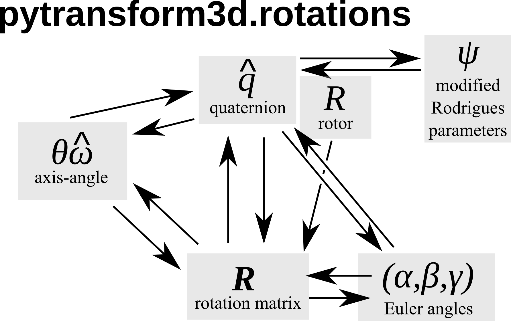

===================
SO(3): 3D Rotations
===================

The group of all rotations in the 3D Cartesian space is called :math:`SO(3)`
(SO: special orthogonal group). It is typically represented by 3D rotations
matrices. The minimum number of components that are required to describe
any rotation from :math:`SO(3)` is 3. However, there is no representation that
is non-redundant, continuous, and free of singularities. We will now take a
closer look at competing representations of rotations and the orientations they
can describe.

.. contents:: :local:
    :depth: 1

Here is an overview of the representations and the conversions between them
that are available in pytransform3d.

Not all representations support all operations directly without conversion to
another representation. The following table is an overview. If the operation
is not implemented in pytransform3d then it is shown in brackets.

+----------------------------------------+---------------+--------------------+---------------+---------------+
| Representation                         | Inverse       | Rotation of vector | Concatenation | Interpolation |
+========================================+===============+====================+===============+===============+
| Rotation matrix                        | Transpose     | Yes                | Yes           | No            |
| :math:`\pmb{R}`                        |               |                    |               |               |
+----------------------------------------+---------------+--------------------+---------------+---------------+
| Compact axis-angle                     | Negative      | No                 | No            | (Yes)         |
| :math:`\pmb{\omega}`                   |               |                    |               |               |
+----------------------------------------+---------------+--------------------+---------------+---------------+
| Axis-angle                             | Negative axis | No                 | No            | Yes           |
| :math:`(\hat{\pmb{\omega}}, \theta)`   |               |                    |               |               |
+----------------------------------------+---------------+--------------------+---------------+---------------+
| Logarithm of rotation                  | Negative      | No                 | No            | (Yes)         |
| :math:`\left[\pmb{\omega}\right]`      |               |                    |               |               |
+----------------------------------------+---------------+--------------------+---------------+---------------+
| Quaternion                             | Conjugate     | Yes                | Yes           | Yes           |
| :math:`\pmb{q}`                        |               |                    |               |               |
+----------------------------------------+---------------+--------------------+---------------+---------------+
| Rotor                                  | Reverse       | Yes                | Yes           | Yes           |
| :math:`R`                              |               |                    |               |               |
+----------------------------------------+---------------+--------------------+---------------+---------------+
| Euler angles                           | No            | No                 | No            | No            |
| :math:`(\alpha, \beta, \gamma)`        |               |                    |               |               |
+----------------------------------------+---------------+--------------------+---------------+---------------+

---------------
Rotation Matrix
---------------

One of the most practical representations of orientation is a rotation matrix

.. math::

    \boldsymbol R =
    \left( \begin{array}{ccc}
        r_{11} & r_{12} & r_{13}\\
        r_{21} & r_{22} & r_{23}\\
        r_{31} & r_{32} & r_{33}\\
    \end{array} \right)
    \in SO(3).

Note that this is a non-minimal representation for orientations because we
have 9 values but only 3 degrees of freedom. This is because
:math:`\boldsymbol R` is orthonormal, which results in 6 constraints
(enforced with :func:`~pytransform3d.rotations.norm_matrix`):

* column vectors must have unit norm (3 constraints)
* and must be orthogonal to each other (3 constraints)

A more compact representation of these constraints is
:math:`\boldsymbol R^T \boldsymbol R = \boldsymbol I
\Leftrightarrow \boldsymbol R^T = \boldsymbol R^{-1}`.

In addition, :math:`det(\boldsymbol R) = 1` because we use right-handed
coordinate system   (:math:`det(\boldsymbol R) = -1` for left-handed
coordinate systems).

pytransform3d uses a numpy array of shape (3, 3) to represent rotation
matrices and typically we use the variable name R for a rotation matrix.

.. warning::

    There are two conventions on how to interpret rotations: active
    or passive rotation. The standard in pytransform3d is an active rotation.

We can use a rotation matrix :math:`\boldsymbol R_{AB}` to transform a point
:math:`_B\boldsymbol{p}` from frame :math:`B` to frame :math:`A`.

.. warning::

    There are two different conventions on how to use rotation matrices to
    apply a rotation to a vector. We can either (pre-)multiply the rotation
    matrix to a column vector from the left side or we can (post-)multiply it
    to a row vector from the right side.
    We will use the **pre-multiplication** convention.

This means that we rotate a point :math:`_B\boldsymbol{p}` by

.. math::

    _A\boldsymbol{p} = \boldsymbol{R}_{ABB} \boldsymbol{p}

This is called **linear map**.

We can see that *each column* of such a rotation matrix is a basis vector
of frame :math:`A` with respect to frame :math:`B`.

We can plot the basis vectors of an orientation to visualize it.

.. note::

    When plotting basis vectors it is a convention to use red for the x-axis,
    green for the y-axis and blue for the z-axis (RGB for xyz).

Here, we can see orientation represented by the rotation matrix

.. math::

    \boldsymbol R =
    \left( \begin{array}{ccc}
        1 & 0 & 0\\
        0 & 1 & 0\\
        0 & 0 & 1\\
    \end{array} \right)

.. plot::
    :include-source:

    from pytransform3d.rotations import plot_basis
    plot_basis()

We can easily chain multiple rotations: we can apply the rotation defined
by :math:`\boldsymbol R_{AB}` after the rotation :math:`\boldsymbol R_{BC}`
by applying the rotation

.. math::

    \boldsymbol R_{AC} = \boldsymbol R_{AB} \boldsymbol R_{BC}.

.. warning::

    There are two different conventions on how to concatenate rotation
    matrices. Suppose we have a rotation matrix :math:`R_1` and another matrix
    :math:`R_2` and we want to first rotate by :math:`R_1` and then by
    :math:`R_2`. If we want to apply both rotations in global coordinates, we
    have to concatenate them with :math:`R_2 \cdot R_1`. We can also express
    the second rotation in terms of a local, body-fixed coordinates by
    :math:`R_1 \cdot R_2`, which means :math:`R_1` defines new coordinates in
    which :math:`R_2` is applied. Note that this applies to both
    passive and active rotation matrices.

**Pros**

* It is easy to apply rotations on point vectors by matrix-vector
  multiplication
* Concatenation of rotations is trivial through matrix multiplication
* You can directly read the basis vectors from the columns
* No singularities

**Cons**

* We use 9 values for 3 degrees of freedom.
* Not every 3x3 matrix is a valid rotation matrix, which means for example
  that we cannot simply apply an optimization algorithm to rotation matrices
  or interpolate between rotation matrices. Renormalization is
  computationally expensive in comparison to quaternions.

----------
Axis-Angle
----------

.. plot:: ../../examples/plots/plot_axis_angle.py

Each rotation can be represented by a single rotation around one axis.
The axis can be represented as a three-dimensional unit vector and the angle
by a scalar:

.. math::

    \left( \hat{\boldsymbol{\omega}}, \theta \right) = \left( \left( \begin{array}{c}\omega_x\\\omega_y\\\omega_z\end{array} \right), \theta \right)

pytransform3d uses a numpy array of shape (4,) for the axis-angle
representation of a rotation, where the first 3 entries correspond to the
unit axis of rotation and the fourth entry to the rotation angle in
radians, and typically we use the variable name a.

It is possible to write this in a more compact way as a rotation vector:

.. math::

    \boldsymbol{\omega} = \theta \hat{\boldsymbol{\omega}}

pytransform3d uses a numpy array of shape (3,) for the compact axis-angle
representation of a rotation and typically we use the variable name a.

We can also refer to this representation as **exponential coordinates of
rotation**. We can easily represent angular velocity as
:math:`\dot{\theta} \hat{\boldsymbol{\omega}}`
and angular acceleration as
:math:`\ddot{\theta} \hat{\boldsymbol{\omega}}` so that we can easily do
component-wise integration and differentiation with this representation.
In addition, we can represent :math:`\theta \hat{\boldsymbol{\omega}}` by
the cross-product matrix

.. math::

    \left[\hat{\boldsymbol{\omega}}\right] \theta
    =
    \left(
    \begin{matrix}
    0 & -\omega_3 & \omega_2\\
    \omega_3 & 0 & -\omega_1\\
    -\omega_2 & \omega_1 & 0\\
    \end{matrix}
    \right)
    \theta
    \in so(3)
    \subset \mathbb{R}^{3 \times 3},

where :math:`\left[\hat{\boldsymbol{\omega}}\right] \theta` is the matrix
logarithm of a rotation matrix and :math:`so(3)` is the Lie algebra of
the Lie group :math:`SO(3)`.

**Pros**

* Minimal representation (as rotation vector, also referred to as compact axis-angle in the code)
* It is easy to interpret the representation (as axis and angle)
* Can also represent angular velocity and acceleration when we replace
  :math:`\theta` by :math:`\dot{\theta}` or :math:`\ddot{\theta}` respectively,
  which makes numerical integration and differentiation easy.

**Cons**

* There might be discontinuities during interpolation as an angle of 0 and
  any multiple of :math:`2\pi` represent the same orientation. This has to
  be considered.
* Concatenation involves conversion to another representation

-----------
Quaternions
-----------

Quaternions are represented by a scalar / real part :math:`w`
and an vector / imaginary part
:math:`x \boldsymbol{i} + y \boldsymbol{j} + z \boldsymbol{k}`.

.. math::

    \boldsymbol{q} = w + x \boldsymbol{i} + y \boldsymbol{j} + z \boldsymbol{k}

.. warning::

    There are two different quaternion conventions: Hamilton's convention
    defines :math:`ijk = -1` and the Shuster or JPL convention (from NASA's
    Jet Propulsion Laboratory, JPL) defines :math:`ijk = 1`.
    These two conventions result in different multiplication operations and
    conversions to other representations. We use Hamilton's convention.

Read `this paper <https://arxiv.org/pdf/1801.07478.pdf>`_ for details about
the two conventions and why Hamilton's convention should be used. Section VI A
gives further useful hints to identify which convention is used.

The unit quaternion space :math:`S^3` can be used to represent orientations.
To do that, we use an encoding based on the rotation axis and angle.
A rotation quaternion is a four-dimensional unit vector (versor)
:math:`\boldsymbol{\hat{q}}`.
The following equation describes its relation to axis-axis notation.

.. math::

    \boldsymbol{\hat{q}} =
    \left( \begin{array}{c} w\\ x\\ y\\ z\\ \end{array} \right) =
    \left( \begin{array}{c}
        \cos \frac{\theta}{2}\\
        \omega_x \sin \frac{\theta}{2}\\
        \omega_y \sin \frac{\theta}{2}\\
        \omega_z \sin \frac{\theta}{2}\\
    \end{array} \right)

pytransform3d uses a numpy array of shape (4,) for quaternions and
typically we use the variable name q.

.. warning::

    The scalar component :math:`w` of a quaternion is sometimes the first
    element and sometimes the last element of the versor. We will use
    the first element to store the scalar component.

.. warning::

    The unit quaternions :math:`\boldsymbol{\hat{q}}` and
    :math:`-\boldsymbol{\hat{q}}` represent exactly the same rotation.

**Pros**

* More compact than the matrix representation and less susceptible to
  round-off errors
* The quaternion elements vary continuously over the unit sphere in
  :math:`\mathbb{R}^4` as the orientation changes, avoiding discontinuous
  jumps (inherent to three-dimensional parameterizations)
* Expression of the rotation matrix in terms of quaternion parameters
  involves no trigonometric functions
* Concatenation is simple and computationally cheaper with the quaternion
  product than with rotation matrices
* No singularities
* Renormalization is cheap in comparison to rotation matrices: we only
  have to divide by the norm of the quaternion.

**Cons**

* The representation is not straightforward to interpret
* There are always two unit quaternions that represent exactly the same
  rotation

------------
Euler Angles
------------

A complete rotation can be split into three rotations around basis vectors.
pytransform3d uses a numpy array of shape (3,) for Euler angles, where
each entry corresponds to a rotation angle in radians around one basis
vector. The basis vector that will be used and the order of rotation
is defined by the convention that we use. See :doc:`euler_angles` for more
information.

.. warning::

    There are 24 different conventions for defining euler angles. There are
    12 different valid ways to sequence rotation axes that can be interpreted
    as extrinsic or intrinsic rotations: XZX, XYX, YXY, YZY, ZYZ, ZXZ, XZY,
    XYZ, YXZ, YZX, ZYX, and ZXY.

**Pros**

* Minimal representation

**Cons**

* 24 different conventions
* Singularities (gimbal lock)
* Concatenation and transformation of vectors requires conversion to rotation
  matrix or quaternion

------
Rotors
------

.. plot:: ../../examples/plots/plot_bivector.py

Rotors and quaternions are very similar concepts in 3D. However, rotors are
more general as they can be extended to more dimensions.

The concept of a quaternion builds on the axis-angle representation, in
which we rotate by an angle about a rotation axis (see black arrow in the
illustration above). The axis can be computed from the cross product of two
vectors (gray arrow). A rotor builds on a plane-angle representation, in which
we rotate with a given direction by an angle in a plane (indicated by gray
area). The plane can be computed from the wedge product :math:`a \wedge b` of
two vectors :math:`a` and :math:`b`, which is a so-called bivector. Although
both approaches might seem different, in 3D they operate with exactly the same
numbers in exactly the same way.

.. warning::

    The rotors :math:`R` and :math:`-R` represent exactly the same rotation.

A rotor is a unit multivector

.. math::

    R = (a, b_{yz}, b_{zx}, b_{xy})

that consists of a scalar :math:`a` and a bivector
:math:`(b_{yz}, b_{zx}, b_{xy})`. The components of a bivector constructed
by the wedge product of two vectors can be interpreted as the area of the
parallelogram formed by the two vectors projected on the three basis planes
yz, zx, and xy (see illustration above). These values also correspond to the
x-, y-, and z-components of the cross product of the two vectors, which allows
two different interpretations of the same numbers from which we can then derive
quaternions on the one hand and rotors on the other hand.

.. warning::

    In pytransform3d our convention is that we organize the components of a
    rotor in exactly the same way as we organize the components of the
    equivalent quaternion. There are other conventions. It is not just possible
    to change the order of the scalar and the bivector (similar to a
    quaterion), but also to change the order of bivector components.

**Pros**

* More compact than the matrix representation.
* Concatenation is simple and computationally cheaper than with rotation
  matrices.
* No singularities.
* Renormalization is cheap in comparison to rotation matrices: we only
  have to divide by the norm of the rotor.

**Cons**

* The representation is not straightforward to interpret

----------
References
----------

1. Why and How to Avoid the Flipped Quaternion Multiplication: https://arxiv.org/pdf/1801.07478.pdf
2. Kindr cheat sheet: https://docs.leggedrobotics.com/kindr/cheatsheet_latest.pdf
3. Let's remove Quaternions from every 3D Engine: https://marctenbosch.com/quaternions/
4. Applications of Geometric Algebra: http://geometry.mrao.cam.ac.uk/wp-content/uploads/2015/02/01ApplicationsI.pdf
5. Euler–Rodrigues formula variations, quaternion conjugation and intrinsic connections: https://doi.org/10.1016/j.mechmachtheory.2015.03.004
