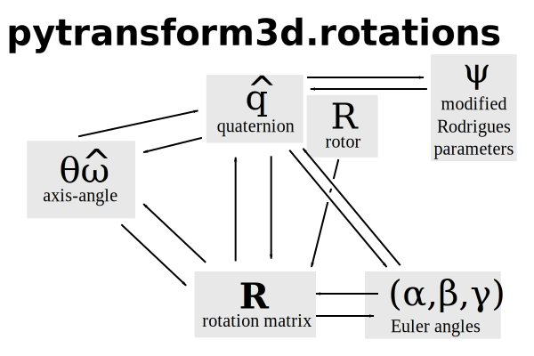

===================
3D Rotations: SO(3)
===================

The group of all rotations in the 3D Cartesian space is called :math:`SO(3)`.
The minimum number of components that are required to describe any rotation
from :math:`SO(3)` is 3. However, there is no representation that is
non-redundant, continuous and free of singularities. We will now take a closer
look at competing representations of rotations and the orientations they can
describe.

Here is an overview of the representations and the conversions between them
that are available in pytransform3d.

The following example illustrates the usage of pytransform3d to perform these
conversions.

.. plot:: ../../examples/plot_compare_rotations.py
    :include-source:

---------------
Rotation Matrix
---------------

The most practical representation of orientation is a rotation matrix

.. math::

    \boldsymbol R =
    \left( \begin{array}{ccc}
        r_{11} & r_{12} & r_{13}\\
        r_{21} & r_{22} & r_{23}\\
        r_{31} & r_{32} & r_{33}\\
    \end{array} \right)

Note that

* this is a non-minimal representation for orientations because we have 9
  values but only 3 degrees of freedom
* :math:`\boldsymbol R` must be orthonormal
* :math:`\boldsymbol R^T = \boldsymbol R^{-1}`
* :math:`det(\boldsymbol R) = 1`

.. warning::

    There are two conventions on how to interpret rotation matrices. We use
    the passive convention. The passive convention assumes that the reference
    coordinate system is changed by the rotation, rotated vectors or points
    stay at their position and are reinterpreted in the new coordinate system.
    Another convention is the active convention. We can easily convert rotation
    matrices between the two conventions by transposing them.

We can use a rotation matrix :math:`\boldsymbol R_{AB}` to transform a point
:math:`_B\boldsymbol{p} := _B\boldsymbol{t}_{BP}` from frame :math:`B` to frame
:math:`A`.

.. warning::

    There are two different conventions on how to use rotation matrices to
    apply a rotation to a vector. We can either (pre-)multiply the rotation
    matrix to a column vector from the left side or we can (post-)multiply it
    to a row vector from the right side.
    We will use the **pre-multiplication** convention.

This means that we rotate a point :math:`_B\boldsymbol{p}` by

.. math::

    _A\boldsymbol{p} = \boldsymbol{R}_{ABB} \boldsymbol{p}

This is called **linear map**.

We can see that *each column* of such a rotation matrix is a basis vector
of frame :math:`A` with respect to frame :math:`B`.

We can plot the basis vectors of an orientation to visualize it.

.. note::

    When plotting basis vectors it is a convention to use red for the x-axis,
    green for the y-axis and blue for the z-axis (RGB for xyz).

Here, we can see orientation represented by the rotation matrix

.. math::

    \boldsymbol R =
    \left( \begin{array}{ccc}
        1 & 0 & 0\\
        0 & 1 & 0\\
        0 & 0 & 1\\
    \end{array} \right)

.. plot::
    :include-source:

    from pytransform3d.rotations import plot_basis
    plot_basis()

We can easily chain multiple rotations: we can apply the rotation defined
by :math:`\boldsymbol R_{AB}` after the rotation :math:`\boldsymbol R_{BC}`
by applying the rotation

.. math::

    \boldsymbol R_{AC} = \boldsymbol R_{AB} \boldsymbol R_{BC}.

.. warning::

    There are two different conventions on how to concatenate rotation
    matrices. Suppose we have a rotation matrix :math:`R_1` and another matrix
    :math:`R_2` and we want to first rotate by :math:`R_1` and then by
    :math:`R_2`. If we want to apply both rotations in global coordinates, we
    have to concatenate them with :math:`R_1 \cdot R_2`. We can also express
    the second rotation in terms of a local, body-fixed coordinates by
    :math:`R_2 \cdot R_1`, which means :math:`R_1` defines new coordinates in
    which :math:`R_2` is applied.

**Pros**

* It is easy to apply rotations on point vectors
* Concatenation of rotations is trivial
* You can directly read the basis vectors from the columns

**Cons**

* We use 9 values for 3 degrees of freedom
* Not every 3x3 matrix is a valid rotation matrix, which means for example
  that we cannot simply apply an optimization algorithm to rotation matrices

----------
Axis-Angle
----------

Each rotation can be represented by a single rotation around one axis.

.. plot:: ../../examples/plot_axis_angle.py
    :include-source:

The axis can be represented as a three-dimensional unit vector and the angle
by a scalar:

.. math::

    \left( \boldsymbol{\hat{e}}, \theta \right) = \left( \left( \begin{array}{c}e_x\\e_y\\e_z\end{array} \right), \theta \right)

It is possible to write this in a more compact way as a rotation vector:

.. math::

    \boldsymbol{v} = \theta \boldsymbol{\hat{e}}

**Pros**

* Minimal representation (as rotation vector, also referred to as compact axis-angle in the code)
* It is easy to interpret the representation (as axis and angle)

**Cons**

* Concatenation involves conversion to another representation

------------
Euler Angles
------------

A complete rotation can be split into three rotations around basis vectors.

.. warning::

    There are 24 different conventions for defining euler angles. There are
    12 different valid ways to sequence rotation axes that can be interpreted
    as extrinsic or intrinsic rotations: XZX, XYX, YXY, YZY, ZYZ, ZXZ, XZY,
    XYZ, YXZ, YZX, ZYX, and ZXY. We will only use the XYZ convention and the
    ZYX convention with intrinsic rotations.

.. plot:: ../../examples/plot_euler_angles.py
    :include-source:

**Pros**

* Minimal representation

**Cons**

* 24 different conventions
* Singularities (gimbal lock)

-----------
Quaternions
-----------

Quaternions are represented by a scalar / real part :math:`w`
and an imaginary / vector part
:math:`x \boldsymbol{i} + y \boldsymbol{j} + z \boldsymbol{k}`.

.. math::

    \boldsymbol{q} = w + x \boldsymbol{i} + y \boldsymbol{j} + z \boldsymbol{k}

.. warning::

    There are two different quaternion conventions: Hamilton's convention
    defines :math:`ijk = -1` and the JPL convention (from NASA's Jet Propulsion
    Laboratory, JPL) defines :math:`ijk = 1`. We use Hamilton's convention.

Read `this paper <https://arxiv.org/pdf/1801.07478.pdf>`_ for details about the
two conventions and why Hamilton's convention should be used. Section VI A
gives useful hints to identify which convention is used.

The unit quaternion space :math:`S^3` can be used to represent orientations.
To do that, we use an encoding based on the rotation axis and angle.
A rotation quaternion is a four-dimensional unit vector (versor)
:math:`\boldsymbol{\hat{q}}`.
The following equation describes its relation to axis-axis notation.

.. math::

    \boldsymbol{\hat{q}} =
    \left( \begin{array}{c} w\\ x\\ y\\ z\\ \end{array} \right) =
    \left( \begin{array}{c}
        \cos \frac{\theta}{2}\\
        e_x \sin \frac{\theta}{2}\\
        e_y \sin \frac{\theta}{2}\\
        e_z \sin \frac{\theta}{2}\\
    \end{array} \right)

.. warning::

    The scalar component :math:`w` of a quaternion is sometimes the first
    element and sometimes the last element of the versor. We will use
    the first element to store the scalar component.

.. warning::

    The unit quaternions :math:`\boldsymbol{\hat{q}}` and
    :math:`-\boldsymbol{\hat{q}}` represent exactly the same rotation.

**Pros**

* More compact than the matrix representation and less susceptible to
  round-off errors
* The quaternion elements vary continuously over the unit sphere in
  :math:`\mathbb{R}^4` as the orientation changes, avoiding discontinuous
  jumps (inherent to three-dimensional parameterizations)
* Expression of the rotation matrix in terms of quaternion parameters
  involves no trigonometric functions
* Concatenation is simple and computationally cheaper with the quaternion
  product than with rotation matrices

**Cons**

* The representation is not straightforward to interpret
* There are always two unit quaternions that represent exactly the same
  rotation
