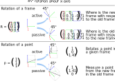

==========================
Transformation Ambiguities
==========================

There are lots of ambiguities in the world of transformations. We try to
explain them all here.

----------------------------------------------
Right-handed vs. Left-handed Coordinate System
----------------------------------------------

We typically use a right-handed coordinate system, that is, the x-, y- and
z-axis are aligned in a specific way. The name comes from the way how the
fingers are attached to the human hand. Try to align your thumb with the
imaginary x-axis, your index finger with the y-axis, and your middle finger
with the z-axis. It is possible to do this with a right hand in a
right-handed system and with the left hand in a left-handed system.

.. raw:: html

    <table>
    <tr><td>Right-handed</td><td>Left-handed</td></tr>
    <tr>
    <td>

.. plot::
    :width: 400px

    import numpy as np
    import matplotlib.pyplot as plt
    from pytransform3d.plot_utils import make_3d_axis

    plt.figure()
    ax = make_3d_axis(1)
    plt.setp(ax, xlim=(-0.05, 1.05), ylim=(-0.05, 1.05), zlim=(-0.05, 1.05),
            xlabel="X", ylabel="Y", zlabel="Z")

    basis = np.eye(3)
    for d, c in enumerate(["r", "g", "b"]):
        ax.plot([0.0, basis[0, d]],
                [0.0, basis[1, d]],
                [0.0, basis[2, d]], color=c, lw=5)

    plt.show()

.. raw:: html

    </td>
    <td>

.. plot::
    :width: 400px

    import numpy as np
    import matplotlib.pyplot as plt
    from pytransform3d.plot_utils import make_3d_axis

    plt.figure()
    ax = make_3d_axis(1)
    plt.setp(ax, xlim=(-0.05, 1.05), ylim=(-0.05, 1.05), zlim=(-1.05, 0.05),
            xlabel="X", ylabel="Y", zlabel="Z")

    basis = np.eye(3)
    basis[:, 2] *= -1.0
    for d, c in enumerate(["r", "g", "b"]):
        ax.plot([0.0, basis[0, d]],
                [0.0, basis[1, d]],
                [0.0, basis[2, d]], color=c, lw=5)

    plt.show()

.. raw:: html

    </td>
    </tr>
    <table>

.. note::

    The default in pytransform3d is a right-handed coordinate system.

-------------------------------------------------
Active (Alibi) vs. Passive (Alias) Transformation
-------------------------------------------------

An active transformation

* changes the physical position of an object
* can be defined in the absence of a coordinate system or does not change the
  current coordinate system
* is used exclusively by mathematicians

Another name for active transformation is alibi transformation.

A passive transformation

* changes the coordinate system in which the object is described
* does not change the object
* could be used by physicists and engineers (e.g. roboticists)

Another name for passive transformation is alias transformation.

The following illustration compares the active view with the passive view.
The position of the data is interpreted in the frame indicated by solid
axes.
We use exactly the same transformation matrix in both plots.
In the active view, we see that the transformation is applied to the data.
The data is physically moved. The dashed basis represents a frame that is
moved from the base frame with the same transformation. The data is
now interpreted in the old frame.
In a passive transformation, we move the frame with the transformation.
The data stays at its original position but it is interpreted in the new
frame.

.. raw:: html

    <table>
    <tr><td>Active</td><td>Passive</td></tr>
    <tr>
    <td>

.. plot::
    :width: 400px

    import numpy as np
    import matplotlib.pyplot as plt
    from pytransform3d.transformations import transform, plot_transform
    from pytransform3d.plot_utils import make_3d_axis, Arrow3D

    plt.figure()
    ax = make_3d_axis(1)
    plt.setp(ax, xlim=(-1.05, 1.05), ylim=(-0.55, 1.55), zlim=(-1.05, 1.05),
                xlabel="X", ylabel="Y", zlabel="Z")
    ax.view_init(elev=90, azim=-90)
    ax.set_xticks(())
    ax.set_yticks(())
    ax.set_zticks(())

    random_state = np.random.RandomState(42)
    PA = np.ones((10, 4))
    PA[:, :3] = 0.1 * random_state.randn(10, 3)
    PA[:, 0] += 0.3
    PA[:, :3] += 0.3

    x_translation = -0.1
    y_translation = 0.2
    z_rotation = np.pi / 4.0
    A2B = np.array([
        [np.cos(z_rotation), -np.sin(z_rotation), 0.0, x_translation],
        [np.sin(z_rotation), np.cos(z_rotation), 0.0, y_translation],
        [0.0, 0.0, 1.0, 0.0],
        [0.0, 0.0, 0.0, 1.0]
    ])
    PB = transform(A2B, PA)

    plot_transform(ax=ax, A2B=np.eye(4))
    ax.scatter(PA[:, 0], PA[:, 1], PA[:, 2], c="orange")
    plot_transform(ax=ax, A2B=A2B, ls="--", alpha=0.5)
    ax.scatter(PB[:, 0], PB[:, 1], PB[:, 2], c="cyan")

    axis_arrow = Arrow3D(
        [0.7, 0.3],
        [0.4, 0.9],
        [0.2, 0.2],
        mutation_scale=20, lw=3, arrowstyle="-|>", color="k")
    ax.add_artist(axis_arrow)

    plt.tight_layout()
    plt.show()

.. raw:: html

    </td>
    <td>

.. plot::
    :width: 400px

    import numpy as np
    import matplotlib.pyplot as plt
    from mpl_toolkits.mplot3d import proj3d
    from pytransform3d.transformations import transform, plot_transform
    from pytransform3d.plot_utils import make_3d_axis, Arrow3D

    plt.figure()
    ax = make_3d_axis(1)
    plt.setp(ax, xlim=(-1.05, 1.05), ylim=(-0.55, 1.55), zlim=(-1.05, 1.05),
                xlabel="X", ylabel="Y", zlabel="Z")
    ax.view_init(elev=90, azim=-90)
    ax.set_xticks(())
    ax.set_yticks(())
    ax.set_zticks(())

    random_state = np.random.RandomState(42)
    PA = np.ones((10, 4))
    PA[:, :3] = 0.1 * random_state.randn(10, 3)
    PA[:, 0] += 0.3
    PA[:, :3] += 0.3

    x_translation = -0.1
    y_translation = 0.2
    z_rotation = np.pi / 4.0
    A2B = np.array([
        [np.cos(z_rotation), -np.sin(z_rotation), 0.0, x_translation],
        [np.sin(z_rotation), np.cos(z_rotation), 0.0, y_translation],
        [0.0, 0.0, 1.0, 0.0],
        [0.0, 0.0, 0.0, 1.0]
    ])

    plot_transform(ax=ax, A2B=np.eye(4), ls="--", alpha=0.5)
    ax.scatter(PA[:, 0], PA[:, 1], PA[:, 2], c="orange")
    plot_transform(ax=ax, A2B=A2B)

    axis_arrow = Arrow3D(
        [0.0, -0.1],
        [0.0, 0.2],
        [0.2, 0.2],
        mutation_scale=20, lw=3, arrowstyle="-|>", color="k")
    ax.add_artist(axis_arrow)

    plt.tight_layout()
    plt.show()

.. raw:: html

    </td>
    </tr>
    <table>

Using the inverse transformation in the active view gives us exactly the same
solution as the original transformation in the passive view and vice versa.

It is usually easy to determine whether the active or the passive convention
is used by taking a look at the rotation matrix: when we rotate
counter-clockwise by an angle :math:`\theta` about the z-axis, the following
rotation matrix is usually used in an active transformation:

.. math::

    \left( \begin{array}{ccc}
        \cos \theta & -\sin \theta & 0 \\
        \sin \theta & \cos \theta & 0 \\
        0 & 0 & 1\\
    \end{array} \right)

Its transformed version is usually used for a passive transformation:

.. math::

    \left( \begin{array}{ccc}
        \cos \theta & \sin \theta & 0 \\
        -\sin \theta & \cos \theta & 0 \\
        0 & 0 & 1\\
    \end{array} \right)

.. note::

    Rotation matrices represent passive transformations by default in pytransform3d.

Reference:

Selig, J.M.: Active Versus Passive Transformations in Robotics, 2006,
IEEE Robotics and Automation Magazine.
PDF: https://openresearch.lsbu.ac.uk/download/641fa36d365e0244b27dd2fc8b881a12061afe1eb5c3952bae15614d3d831710/185181/01598057.pdf.

----------------------------------------
Pre-multiply vs. Post-multiply Rotations
----------------------------------------

The same point can be represented by a column vector :math:`\boldsymbol v` or
a row vector :math:`\boldsymbol w`. A rotation matrix :math:`\boldsymbol R`
can be used to rotate the point by pre-multiplying it to the column vector
:math:`\boldsymbol R \boldsymbol v` or by post-multiplying it to the row
vector :math:`\boldsymbol w \boldsymbol R`. However, for the same rotation
matrix, both approaches are inverse:
:math:`\boldsymbol R^T \boldsymbol v = \boldsymbol w \boldsymbol R`.
Hence, to achieve the same effect we have to use two different rotation
matrices depending on how we multiply them to points.

.. note::

    The default in pytransform3d are pre-multiplied rotation matrices.

--------------------------------
Intrinsic vs. Extrinsic Rotation
--------------------------------

A similar problem occurs when we want to concatenate rotations:
suppose we have two rotations matrices :math:`\boldsymbol R` and
:math:`\boldsymbol R` and we want to concatenate them. We can either
compute :math:`\boldsymbol R \boldsymbol R'` or
:math:`\boldsymbol R' \boldsymbol R`. The following equality holds:
:math:`(\boldsymbol R' \boldsymbol R)^T = \boldsymbol R^T \boldsymbol R'^T`.

:math:`R \cdot R'` means that the rotation :math:`R'` is applied in the
local coordinate frame defined by :math:`R`. The second option
:math:`R' \cdot R` is equivalent to rotating :math:`R` in the global
coordinate system.

In the following plot you see the original frame in the background.
The first rotation :math:`R` rotates 45 degrees about the x-axis.
The result can be seen in the middle. The second rotation :math:`R'`
rotates 90 degrees about the z-axis. On the left side, we compute
:math:`R'R`. The result is that the rotation about the z-axis is
done before the rotation about the x-axis or the rotation about the
z-axis is an extrinsic rotation because it is applied in the global
coordinate system. On the right side we see the result of :math:`RR'`.
The rotation about the z-axis is applied after the rotation about the
x-axis, hence, it is applied to the local coordinate system. It
can be called and intrinsic rotation.

.. plot::

    import numpy as np
    import matplotlib.pyplot as plt
    from mpl_toolkits.mplot3d import Axes3D
    from pytransform3d.rotations import *

    ax = plot_basis(R=np.eye(3), p=np.array([-1.0, 0.0, 0.0]), ax_s=2)

    R1 = matrix_from_angle(0, np.pi / 4.0)
    R2 = matrix_from_angle(2, np.pi / 2.0)

    plot_basis(ax, R1, np.array([1.0, 0.0, 0.0]))
    plot_basis(ax, R1.dot(R2), np.array([1.0, 1.5, 0.0]))
    plot_basis(ax, R2.dot(R1), np.array([1.0, -1.5, 0.0]))

    ax.view_init(azim=10, elev=25)

    plt.show()

.. note::

    The default in pytransform3d are intrinsic rotations.
