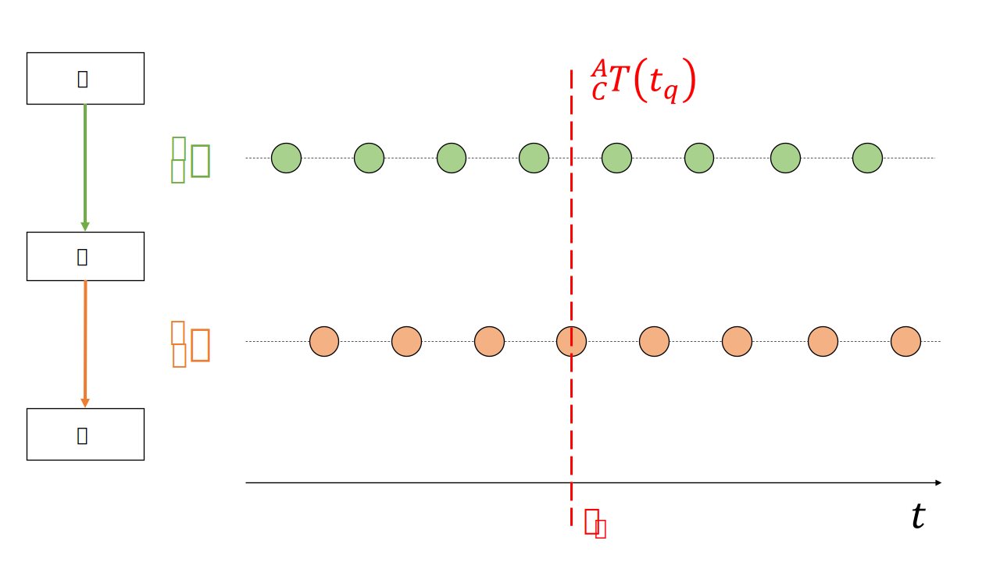

========================
Managing Transformations over Time
========================

In applications, where the transformations between coordinate frames are 
changing over time, prior to using 
:class:`~pytransform3d.transform_manager.TransformManager` 
you should consider interpolating between samples.

We can visualize the problem in the figure below. The tranformation graph with 
3 coordinate systems: world, A, B is visualized over time. Each circle 
represents a sample (measurement) holding the transformation from the parent 
to the child frame.

Let's assume we want inspect the situation at the timestep tq (q=query). 
In order to use the :class:`~pytransform3d.transform_manager.TransformManager`
to traverse the graph, we have to interpolate the transformation between 
the A and B frame.

Various approaches exist:

- linear transformation of the translation and SLERP interpolation of the quaternion
- Screw linear interpolation (ScLERP) for dual quaternions. Note that a dual 
    quaternion holds both the translation and rotation info.

.. literalinclude:: ../../examples/plots/plot_interpolation_for_transform_manager.py
   :language: python
