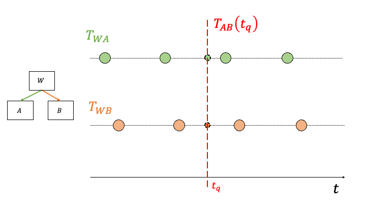

==================================
Managing Transformations over Time
==================================

In applications, where the transformations between coordinate frames are 
dynamic (i.e. changing over time), consider using 
:class:`~pytransform3d.transform_manager.TemporalTransformManager`. In contrast to
the :class:`~pytransform3d.transform_manager.TransformManager`, 
which deals with static transfomations, it provides an
interface for the logic needed to interpolate between transformation samples 
available over time.

We can visualize the lifetime of two dynamic transformations 
(i.e. 3 coordinate systems) in the figure below.
Each circle represents a sample (measurement) holding the transformation from the parent 
to the child frame.

A common use-case is to transform points originating from system A to system B at
a specific point in time :math:`t_q` (q=query). 
Imagine two moving robots A & B reporting their observations between each other.

