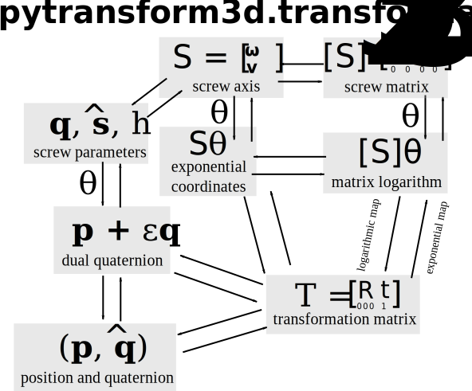

=========================
SE(3): 3D Transformations
=========================

The group of all transformations in the 3D Cartesian space is :math:`SE(3)`
(SE: special Euclidean group).
Transformations consist of a rotation and a translation. Those can be
represented in different ways just like rotations can be expressed
in different ways. For most representations of orientations we can find
an analogous representation of transformations:

* A **transformation matrix** :math:`\boldsymbol T` is similar to a rotation
  matrix :math:`\boldsymbol R`.
* A **screw axis** :math:`\mathcal S` is similar to a rotation axis
  :math:`\hat{\boldsymbol{\omega}}`.
* A **twist** :math:`\mathcal V = \mathcal{S} \dot{\theta}` is similar to
  angular velocity :math:`\hat{\boldsymbol{\omega}} \dot{\theta}`.
* Exponential coordinates :math:`\mathcal{S} \theta` for rigid body motions
  are similar to exponential coordinates
  :math:`\hat{\boldsymbol{\omega}} \theta` for rotations (axis-angle
  representation).

Here is an overview of the representations and the conversions between them
that are available in pytransform3d.

---------------------
Transformation Matrix
---------------------

One of the most convenient ways to represent transformations are
transformation matrices. A transformation matrix is a 4x4 matrix of
the form

.. math::

    \boldsymbol T =
    \left( \begin{array}{cc}
        \boldsymbol R & \boldsymbol t\\
        \boldsymbol 0 & 1\\
    \end{array} \right)
    =
    \left(
    \begin{matrix}
    r_{11} & r_{12} & r_{13} & t_1\\
    r_{21} & r_{22} & r_{23} & t_2\\
    r_{31} & r_{32} & r_{33} & t_3\\
    0 & 0 & 0 & 1\\
    \end{matrix}
    \right)

It is a partitioned matrix with a 3x3 rotation matrix :math:`\boldsymbol R`
and a column vector :math:`\boldsymbol t` that represents the translation.
It is also sometimes called the homogeneous representation of a transformation.
All transformation matrices form the special Euclidean group :math:`SE(3)`.

It is possible to transform position vectors or direction vectors with it.
Position vectors are represented as a column vector
:math:`\left( x,y,z,1 \right)^T`.
This will activate the translation part of the transformation in a matrix
multiplication. When we transform a direction vector, we want to deactivate
the translation by setting the last component to zero:
:math:`\left( x,y,z,0 \right)^T`.

We can use a transformation matrix :math:`\boldsymbol T_{AB}` to transform a
point :math:`\boldsymbol{p}_B := _B\boldsymbol{t}_{BP}` from frame :math:`B`
to frame :math:`A`. For example, transforming a position vector :math:`p`
will give the following result:

.. math::

    \boldsymbol T_{AB} \boldsymbol p_B =
    \left( \begin{array}{c}
        \boldsymbol R \boldsymbol p_B + \boldsymbol t\\
        1\\
    \end{array} \right)

-----------------------
Position and Quaternion
-----------------------

An alternative to transformation matrices is the representation in a
7-dimensional vector that consists of the translation and a rotation
quaternion:

.. math::

    \left( \begin{array}{c}
        x\\y\\z\\q_w\\q_x\\q_y\\q_z
    \end{array} \right)

This representation is more compact than a transformation matrix and is
particularly useful if you want to represent a sequence of poses in
a 2D array.

-----------------------
Exponential Coordinates
-----------------------

Just like any rotation can be expressed as a rotation by an angle about a
3D unit vector, any transformation (rotation and translation) can be expressed
by a motion along a screw axis. A screw axis is represented by a point vector
:math:`\boldsymbol{q}` through which the screw axis passes, a (unit) direction
vector :math:`\hat{\boldsymbol{s}}` that indicates the direction of the axis,
and the pitch :math:`h`. The pitch represents the ratio of translation and
rotation. A screw motion translates along the screw axis and rotates about it.

.. image:: _static/screw_axis.svg
   :alt: Screw axis
   :width: 80%
   :align: center

A screw axis is typically represented by
:math:`\mathcal{S} = \left[\begin{array}{c}\boldsymbol{\omega}\\\boldsymbol{v}\end{array}\right]`,
where either

1. :math:`||\boldsymbol{\omega}|| = 1` or
2. :math:`||\boldsymbol{\omega}|| = 0` and :math:`||\boldsymbol{v}|| = 1`
   (only translation).

In case 1, we can compute the screw axis from screw parameters
:math:`(\boldsymbol{q}, \hat{\boldsymbol{s}}, h)` as

.. math::

    \mathcal{S} = \left[ \begin{array}{c}\hat{\boldsymbol{s}} \\ \boldsymbol{q} \times \hat{\boldsymbol{s}} + h \hat{\boldsymbol{s}}\end{array} \right]

In case 2, :math:`h` is infinite and we directly translate along :math:`\hat{\boldsymbol{s}}`.

With the additional parameter :math:`\theta` we can then define a complete
transformation through its exponential coordinates :math:`\mathcal{S} \theta`.
This is a minimal representation as it only needs 6 values.
