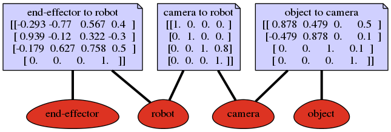

=====================================
Organizing Transformations in a Graph
=====================================

It is sometimes very difficult to have an overview of all the transformations
that are required to calculate another transformation. Suppose you have
a robot with a camera that can observe the robot's end-effector and an object
that we want to manipulate. We would like to know the position of the
end-effector in the object's frame so that we can control it.

We can organize transformations in a graph like the one shown in the figure
below. Each frame represents a vertex (node) and each transformation an edge
(connection). Edges in these graphs are directed, but we can create an edge
in the opposite direction by inverting the transformation. If we want to
compute a new edge indicated by the dashed red arrow, we have to use known
transformations, that is, we compute the shortest path through the undirected
graph, concatenate transformations along the path, and invert transformations
if required as indicated by the solid red arrow.

.. figure:: ../_static/transform_graph.png
    :width: 35%
    :align: center

    Example of a graph representing transformations that connect frames.

The :class:`~pytransform3d.transform_manager.TransformManager` does this for
you. For the given example, this would be the corresponding code
(see also: :ref:`sphx_glr__auto_examples_plots_plot_transform_manager.py`).

.. literalinclude:: ../../../examples/plots/plot_transform_manager.py
   :language: python
   :lines: 27-32

We can also export the underlying graph structure as a PNG with

.. code-block:: python

    tm.write_png(filename)

|

A subclass of :class:`~pytransform3d.transform_manager.TransformManager` is
:class:`~pytransform3d.urdf.UrdfTransformManager` which can load robot
definitions from `URDF <http://wiki.ros.org/urdf/Tutorials>`_ files.
The same class can be used to display collision objects or visuals from URDF
files. The library `trimesh <https://trimsh.org/>`_ will be used to load
meshes. Here is a simple example with one visual that is used for two links:
:ref:`sphx_glr__auto_examples_plots_plot_urdf_with_meshes.py`.

Note that we can use Matplotlib or Open3D to visualize URDFs or any graph of
transformations. In previous versions of this library, an example using
pyrender was also included. This has been removed, as there is now another
software package that does this:
`urdf_viz <https://github.com/IRP-TU-BS/urdf_viz>`_. urdf_viz uses
pytransform3d to load URDFs and displays them in pyrender.
