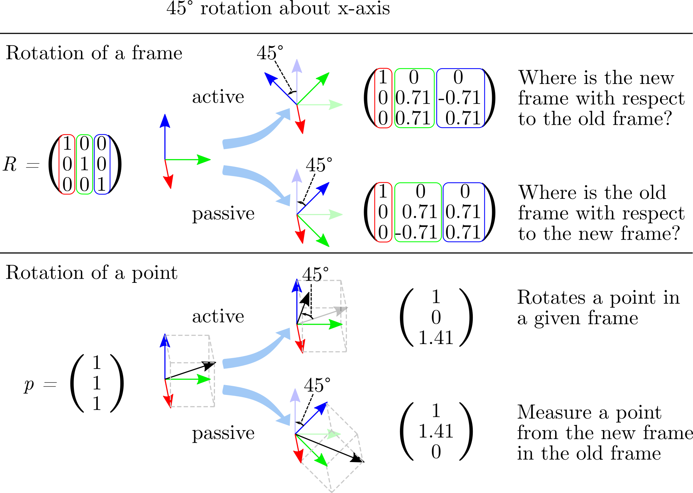
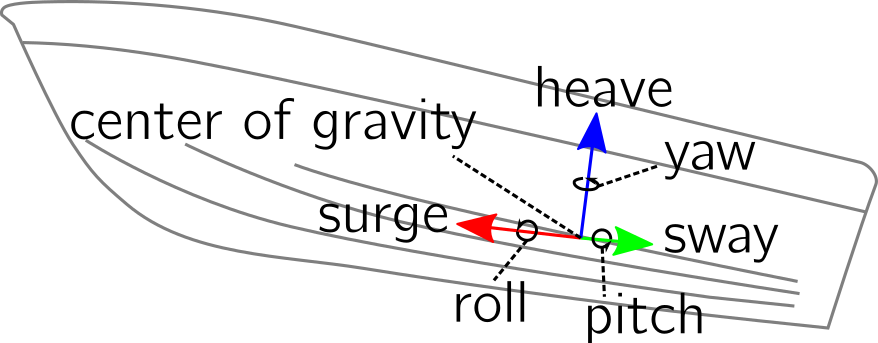
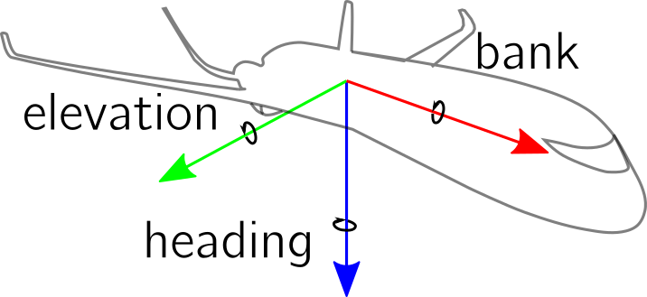
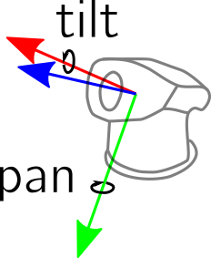

.. _transformation_ambiguities:

==========================================
Transformation Ambiguities and Conventions
==========================================

Heterogenous software systems that consist of proprietary and open source
software are often combined when we work with transformations.
For example, suppose you want to transfer a trajectory demonstrated by a human
to a robot. The human trajectory could be measured from an RGB-D camera, fused
with IMU sensors that are attached to the human, and then translated to
joint angles by inverse kinematics. That involves at least three different
software systems that might all use different conventions for transformations.
Sometimes even one software uses more than one convention.
The following aspects are of crucial importance to glue and debug
transformations in systems with heterogenous and often incompatible
software:

* Compatibility: Compatibility between heterogenous softwares is a difficult
  topic. It might involve, for example, communicating between proprietary and
  open source software or different languages.
* Conventions: Lots of different conventions are used for transformations
  in three dimensions. These have to be determined or specified.
* Conversions: We need conversions between these conventions to
  communicate transformations between different systems.
* Visualization: Finally, transformations should be visually verified
  and that should be as easy as possible.

pytransform3d assists in solving these issues. This documentation clearly
states all of the used conventions, it aims at making conversions between
rotation and transformation conventions as easy as possible, it is tightly
coupled with Matplotlib to quickly visualize (or animate) transformations and
it is written in Python with few dependencies. Python is a widely adopted
language. It is used in many domains and supports a wide spectrum of
communication to other software.

There are lots of ambiguities in the world of transformations. We try to
explain them all here.

----------------------------------------------
Right-handed vs. Left-handed Coordinate System
----------------------------------------------

We typically use a right-handed coordinate system, that is, the x-, y- and
z-axis are aligned in a specific way. The name comes from the way how the
fingers are attached to the human hand. Try to align your thumb with the
imaginary x-axis, your index finger with the y-axis, and your middle finger
with the z-axis. It is possible to do this with a right hand in a
right-handed system and with the left hand in a left-handed system.

.. raw:: html

    <table>
    <tr>
        <th style="text-align:center">Right-handed</th>
        <th style="text-align:center">Left-handed</th>
    </tr>
    <tr>
    <td>

.. plot::
    :width: 400px

    import numpy as np
    import matplotlib.pyplot as plt
    from pytransform3d.plot_utils import make_3d_axis

    plt.figure()
    ax = make_3d_axis(1)
    plt.setp(ax, xlim=(-0.05, 1.05), ylim=(-0.05, 1.05), zlim=(-0.05, 1.05),
            xlabel="X", ylabel="Y", zlabel="Z")

    basis = np.eye(3)
    for d, c in enumerate(["r", "g", "b"]):
        ax.plot([0.0, basis[0, d]],
                [0.0, basis[1, d]],
                [0.0, basis[2, d]], color=c, lw=5)

    plt.show()

.. raw:: html

    </td>
    <td>

.. plot::
    :width: 400px

    import numpy as np
    import matplotlib.pyplot as plt
    from pytransform3d.plot_utils import make_3d_axis

    plt.figure()
    ax = make_3d_axis(1)
    plt.setp(ax, xlim=(-0.05, 1.05), ylim=(-0.05, 1.05), zlim=(-1.05, 0.05),
            xlabel="X", ylabel="Y", zlabel="Z")

    basis = np.eye(3)
    basis[:, 2] *= -1.0
    for d, c in enumerate(["r", "g", "b"]):
        ax.plot([0.0, basis[0, d]],
                [0.0, basis[1, d]],
                [0.0, basis[2, d]], color=c, lw=5)

    plt.show()

.. raw:: html

    </td>
    </tr>
    <table>

.. note::

    The default in pytransform3d is a right-handed coordinate system.

-------------------------------------------------
Active (Alibi) vs. Passive (Alias) Transformation
-------------------------------------------------

There are two different views of transformations: the active and the passive
view [1]_ [2]_.

An active transformation

* changes the physical position of an object
* can be defined in the absence of a coordinate system or does not change the
  current coordinate system
* is the only convention used by mathematicians

Another name for active transformation is alibi transformation.

A passive transformation

* changes the coordinate system in which the object is described
* does not change the object
* could be used by physicists and engineers (e.g., roboticists)

Another name for passive transformation is alias transformation.

The following illustration compares the active view with the passive view.
The position of the data is interpreted in the frame indicated by solid
axes.
We use exactly the same transformation matrix in both plots.
In the active view, we see that the transformation is applied to the data.
The data is physically moved. The dashed basis represents a frame that is
moved from the base frame with the same transformation. The data is
now interpreted in the old frame.
In a passive transformation, we move the frame with the transformation.
The data stays at its original position but it is interpreted in the new
frame.

.. raw:: html

    <table>
    <tr>
        <th style="text-align:center">Active</th>
        <th style="text-align:center">Passive</th>
    </tr>
    <tr>
    <td>

.. plot::
    :width: 400px

    import numpy as np
    import matplotlib.pyplot as plt
    from pytransform3d.transformations import transform, plot_transform
    from pytransform3d.plot_utils import make_3d_axis, Arrow3D

    plt.figure()
    ax = make_3d_axis(1)
    plt.setp(ax, xlim=(-1.05, 1.05), ylim=(-0.55, 1.55), zlim=(-1.05, 1.05),
                xlabel="X", ylabel="Y", zlabel="Z")
    ax.view_init(elev=90, azim=-90)
    ax.set_xticks(())
    ax.set_yticks(())
    ax.set_zticks(())

    rng = np.random.default_rng(42)
    PA = np.ones((10, 4))
    PA[:, :3] = 0.1 * rng.standard_normal(size=(10, 3))
    PA[:, 0] += 0.3
    PA[:, :3] += 0.3

    x_translation = -0.1
    y_translation = 0.2
    z_rotation = np.pi / 4.0
    A2B = np.array([
        [np.cos(z_rotation), -np.sin(z_rotation), 0.0, x_translation],
        [np.sin(z_rotation), np.cos(z_rotation), 0.0, y_translation],
        [0.0, 0.0, 1.0, 0.0],
        [0.0, 0.0, 0.0, 1.0]
    ])
    PB = transform(A2B, PA)

    plot_transform(ax=ax, A2B=np.eye(4))
    ax.scatter(PA[:, 0], PA[:, 1], PA[:, 2], c="orange")
    plot_transform(ax=ax, A2B=A2B, ls="--", alpha=0.5)
    ax.scatter(PB[:, 0], PB[:, 1], PB[:, 2], c="cyan")

    axis_arrow = Arrow3D(
        [0.7, 0.3],
        [0.4, 0.9],
        [0.2, 0.2],
        mutation_scale=20, lw=3, arrowstyle="-|>", color="k")
    ax.add_artist(axis_arrow)

    plt.tight_layout()
    plt.show()

.. raw:: html

    </td>
    <td>

.. plot::
    :width: 400px

    import numpy as np
    import matplotlib.pyplot as plt
    from mpl_toolkits.mplot3d import proj3d
    from pytransform3d.transformations import transform, plot_transform
    from pytransform3d.plot_utils import make_3d_axis, Arrow3D

    plt.figure()
    ax = make_3d_axis(1)
    plt.setp(ax, xlim=(-1.05, 1.05), ylim=(-0.55, 1.55), zlim=(-1.05, 1.05),
                xlabel="X", ylabel="Y", zlabel="Z")
    ax.view_init(elev=90, azim=-90)
    ax.set_xticks(())
    ax.set_yticks(())
    ax.set_zticks(())

    rng = np.random.default_rng(42)
    PA = np.ones((10, 4))
    PA[:, :3] = 0.1 * rng.standard_normal(size=(10, 3))
    PA[:, 0] += 0.3
    PA[:, :3] += 0.3

    x_translation = -0.1
    y_translation = 0.2
    z_rotation = np.pi / 4.0
    A2B = np.array([
        [np.cos(z_rotation), -np.sin(z_rotation), 0.0, x_translation],
        [np.sin(z_rotation), np.cos(z_rotation), 0.0, y_translation],
        [0.0, 0.0, 1.0, 0.0],
        [0.0, 0.0, 0.0, 1.0]
    ])

    plot_transform(ax=ax, A2B=np.eye(4), ls="--", alpha=0.5)
    ax.scatter(PA[:, 0], PA[:, 1], PA[:, 2], c="orange")
    plot_transform(ax=ax, A2B=A2B)

    axis_arrow = Arrow3D(
        [0.0, -0.1],
        [0.0, 0.2],
        [0.2, 0.2],
        mutation_scale=20, lw=3, arrowstyle="-|>", color="k")
    ax.add_artist(axis_arrow)

    plt.tight_layout()
    plt.show()

.. raw:: html

    </td>
    </tr>
    </table>

Using the inverse transformation in the active view gives us exactly the same
solution as the original transformation in the passive view and vice versa.

It is usually easy to determine whether the active or the passive convention
is used by taking a look at the rotation matrix: when we rotate
counter-clockwise by an angle :math:`\theta` about the z-axis, the following
rotation matrix is usually used in an active transformation:

.. math::

    \left( \begin{array}{ccc}
        \cos \theta & -\sin \theta & 0 \\
        \sin \theta & \cos \theta & 0 \\
        0 & 0 & 1\\
    \end{array} \right)

Its transformed version is usually used for a passive transformation:

.. math::

    \left( \begin{array}{ccc}
        \cos \theta & \sin \theta & 0 \\
        -\sin \theta & \cos \theta & 0 \\
        0 & 0 & 1\\
    \end{array} \right)

.. warning::

    The standard in pytransform3d is an active rotation.

----------------------------------------
Pre-multiply vs. Post-multiply Rotations
----------------------------------------

The same point can be represented by a column vector :math:`\boldsymbol v` or
a row vector :math:`\boldsymbol w`. A rotation matrix :math:`\boldsymbol R`
can be used to rotate the point by pre-multiplying it to the column vector
:math:`\boldsymbol R \boldsymbol v` or by post-multiplying it to the row
vector :math:`\boldsymbol w \boldsymbol R`. However, for the same rotation
matrix, both approaches are inverse:
:math:`\boldsymbol R^T \boldsymbol v = \boldsymbol w \boldsymbol R`.
Hence, to achieve the same effect we have to use two different rotation
matrices depending on how we multiply them to points.

.. note::

    The default in pytransform3d are pre-multiplied rotation matrices.

---------------------------------------
Intrinsic vs. Extrinsic Transformations
---------------------------------------

A similar problem occurs when we want to concatenate rotations
or transformations:
suppose we have a rotation matrix :math:`R_1` and another matrix
:math:`R_2` and we want to first rotate by :math:`R_1` and then by
:math:`R_2`. If we want to apply both rotations in global coordinates
(global, space-fixed / extrinsic rotation), we have to concatenate them with
:math:`R_2 \cdot R_1`. We can also express the second rotation in terms
of a local, body-fixed coordinates (local, body-fixed / intrinsic rotation)
by :math:`R_1 \cdot R_2`, which means :math:`R_1` defines new coordinates
in which :math:`R_2` is applied. Note that this applies to both
passive and active rotation matrices. Specifying this convention is
particularly relevant when we deal with Euler angles.

Here is a comparison between various conventions of concatenation.

.. plot:: ../../examples/plots/plot_convention_rotation_global_local.py

.. warning::

    There are two conventions on how to concatenate rotations and
    transformations: intrinsic and extrinsic transformation.
    There is no default in pytransform3d but usually the function name
    should tell you which convention the function uses.

----------------------------
Naming and Frame Conventions
----------------------------

In addition to transformation and rotation conventions, there are a lot of
different naming and frame conventions. Here are some examples.

   For ships we can use the following convention for the body frame: the x-axis
   is called surge, the y-axis sway, and the z-axis heave. The origin of the
   frame is the center of gravity. For the orientation, the names yaw, pitch,
   and roll are used. Sometimes the body frame is rotated by 180 degrees around
   the x-axis, so that the y-axis points to the right side and the z-axis down.

   Aircrafts sometimes use the following naming conventions for intrinsic
   rotations around the z-, y'-, and x''-axis. The rotation about the z-axis
   is called heading, rotation about the y'-axis is called elevation, and the
   rotation about the x''-axis is called bank.

   Cameras or similar sensors are sometimes mounted on pan/tilt units.
   Typically, first the pan joint rotates the camera about an axis parallel to
   the y-axis of the camera and the tilt joint rotates the camera about an
   axis parallel to the x-axis of the camera. When the axes of rotation
   and of the camera are not perfectly aligned, the camera will also be
   translated by the rotations.

-----------------------------
Conventions of Other Software
-----------------------------

The following is an incomplete list of conventions for representations of
rotations, orientations, transformations, or poses and coordinate frames
other software packages use. It illustrates the diversity that you will
find when you combine different software systems.

`Blender user interface (computer graphics) <https://www.blender.org/>`_

* Active rotations
* Euler angles (are actually Tait-Bryan angles): external rotations, angles in degree
* Quaternion: scalar first

`XSens MVNX format (motion capture) <https://base.xsens.com/hc/en-us/articles/360012672099-MVNX-Version-4-File-Structure>`_

* Active rotations
* Conventions for coordinate frames
    * Axis orientation in the world (global): x north, y west, z up (NWU)
    * Axis orientation on body parts: axes are aligned with world axes when
      subject stands in T pose
    * Quaternion and rotation matrix rotate from sensor frame to world frame,
      that is, they represent the orientation of the sensor with respect to
      the world
* Quaternion: scalar first
* Euler angles: extrinsic roll-pitch-yaw (xyz) convention

`Bullet (physics engine) <https://github.com/bulletphysics/bullet3>`_

* Active rotations
* Euler angles: extrinsic roll-pitch-yaw (xyz) convention
  (getQuaternionFromEuler from pybullet's API)
* Quaternion: scalar last and Hamilton multiplication

`Eigen (linear algebra library) <http://eigen.tuxfamily.org/index.php?title=Main_Page>`_

* Quaternion
    * Scalar first (constructor) and scalar last (internal)
    * Hamilton multiplication

`Peter Corke's robotics toolbox <https://petercorke.com/toolboxes/robotics-toolbox/>`_

* Active rotations
* Euler angles
    * Intrinsic zyz convention
    * Roll-pitch-yaw angles correspond either to intrinsic zyx convention
      (default) or intrinsic xyz convention, which can be selected by a
      parameter
* Quaternion: scalar first and Hamilton multiplication

`Robot Operating System (ROS) <https://www.ros.org/>`_ `(REP103) <https://www.ros.org/reps/rep-0103.html>`_

* Active transformations
* Conventions for coordinate frames
    * Axis orientation on body: x forward, y left, z up
    * Axis orientation in the world: x east, y north, z up (ENU)
    * Axis orientation of optical camera frame (indicated by suffix
      in topic name): z forward, x right, y down
* Euler angles
    * Active, extrinsic roll-pitch-yaw (xyz) convention (as used, e.g.,
      in origin tag of URDF) can be used
    * In addition, the yaw-pitch-roll (zyx) convention can be used, but
      is discouraged
* A `PoseStamped <http://docs.ros.org/en/jade/api/geometry_msgs/html/msg/PoseStamped.html>`_
  is represented with respect to a `frame_id`
* When interpreted as active transformation,
  `TransformStamped <http://docs.ros.org/en/jade/api/geometry_msgs/html/msg/TransformStamped.html>`_
  represents a transformation from *child frame* to its (parent) *frame*
* `Quaternion <http://docs.ros.org/en/jade/api/geometry_msgs/html/msg/Quaternion.html>`_:
  scalar last

`Universal Robot user interface <https://www.universal-robots.com/>`_

* Conventions for coordinate frames
    * Default axis orientation of tool center point: z forward
      (approach direction), x and y axes define the orientation
      with which we approach the target
* Euler angles: extrinsic roll-pitch-yaw (xyz) convention

----------
References
----------

.. [1] Selig, J.M. (2006): Active Versus Passive Transformations in Robotics.
   IEEE Robotics and Automation Magazine, 13(1), pp. 79-84, doi:
   10.1109/MRA.2006.1598057. https://ieeexplore.ieee.org/document/1598057

.. [2] Wikipedia: Active and passive transformation.
   https://en.wikipedia.org/wiki/Active_and_passive_transformation
