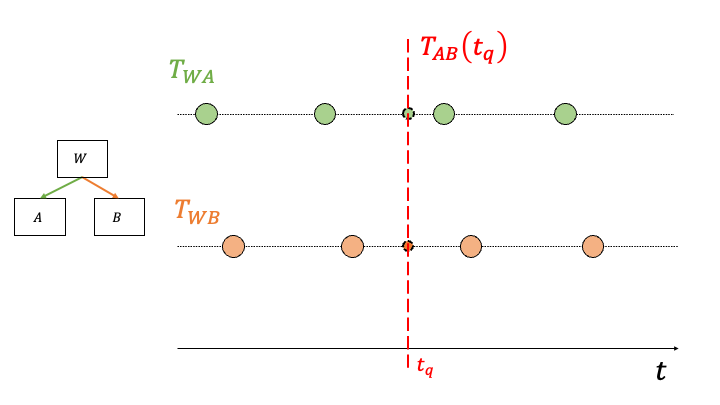

.. _transformations_over_time:

========================================
Graphs of Time-Dependent Transformations
========================================

In applications, where the transformations between coordinate frames are
dynamic (i.e., changing over time), consider using
:class:`~pytransform3d.transform_manager.TemporalTransformManager`. In contrast
to the :class:`~pytransform3d.transform_manager.TransformManager`,
which deals with static transfomations, it provides an interface for the logic
needed to interpolate between transformation samples available over time.

We can visualize the lifetime of two dynamic transformations (i.e., 3
coordinate systems) in the figure below. Each circle represents a sample
(measurement) holding the transformation from the parent to the child frame.

A common use case is to transform points originating from system A to system B
at a specific point in time (i.e., :math:`t_q`, where :math:`q` refers to
query). Imagine two moving robots A & B reporting their observations between
each other.

--------------------------------------
Preparing the Transformation Sequences
--------------------------------------

First, you need to prepare the transfomation sequences using the 
:class:`~pytransform3d.transform_manager.NumpyTimeseriesTransform` class:

.. literalinclude:: ../../../examples/plots/plot_interpolation_for_transform_manager.py
   :language: python
   :lines: 47-60

In this example, the screw linear interpolation (ScLERP) will be used
(which operates on dual quaternions, refer to
:func:`~pytransform3d.transformations.pq_from_dual_quaternion`).

For more control, you may want to add your own implementation of the
abstract class :class:`~pytransform3d.transform_manager.TimeVaryingTransform`.

Next, you need to pass the transformations to an instance of
:class:`~pytransform3d.transform_manager.TemporalTransformManager`:

.. literalinclude:: ../../../examples/plots/plot_interpolation_for_transform_manager.py
   :language: python
   :lines: 62-65

------------------------------------
Transform Between Coordinate Systems
------------------------------------

Finally, you can transform between coordinate systems at a particular time
:math:`t_q`:

.. literalinclude:: ../../../examples/plots/plot_interpolation_for_transform_manager.py
   :language: python
   :lines: 67-72

The coordinates of A's origin (blue diamond) transformed to B are visualized
in the plot below:

.. figure:: ../_auto_examples/plots/images/sphx_glr_plot_interpolation_for_transform_manager_001.png
   :target: ../_auto_examples/plots/plot_interpolation_for_transform_manager.html
   :align: center

--------------------------------
Receiving Transformations Online
--------------------------------

When samples arrive incrementally, use
:class:`~pytransform3d.transform_manager.BufferedTimeseriesTransform` instead
of constructing the entire time series in advance. Register the history once;
the manager sees new samples as they are appended:

.. code-block:: python

    from pytransform3d.transform_manager import (
        BufferedTimeseriesTransform, TemporalTransformManager,
    )

    history = BufferedTimeseriesTransform(max_samples=100)
    manager = TemporalTransformManager()
    manager.add_transform("sensor", "world", history)

    history.append(0.0, [0, 0, 0, 1, 0, 0, 0])
    history.append(1.0, [1, 0, 0, 1, 0, 0, 0])
    sensor_to_world = manager.get_transform_at_time("sensor", "world", 0.5)

Timestamps must be finite and strictly increasing. Poses use the position and
quaternion format ``(x, y, z, qw, qx, qy, qz)``. Inputs are copied and
quaternions are normalized when appended. Invalid samples leave the history
unchanged.

Once ``max_samples`` is reached, appending discards the oldest sample. Queries
outside the retained interval raise ``ValueError`` unless ``time_clipping=True``
was requested. With clipping enabled, they return the closest retained endpoint.
An empty history cannot be queried. A single sample can be queried at its own
timestamp, or at any time with clipping. Use ``max_samples=1`` with clipping to
retain only the latest pose. ``clear()`` discards all samples and allows a new
timestamp sequence, for example after restarting a sensor clock.

Appending takes constant time. The first query after a change builds a NumPy
snapshot of the retained samples, which takes linear time in the history size;
subsequent queries reuse it. The history uses the existing ScLERP interpolation
and adds no dependencies. Concurrent access must be synchronized by the caller.
