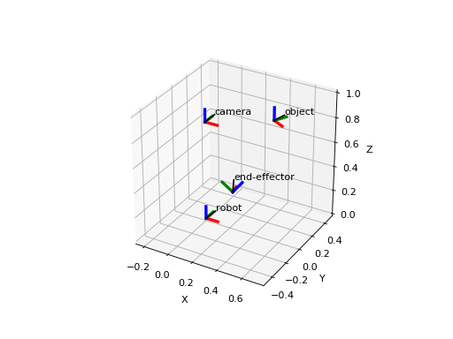
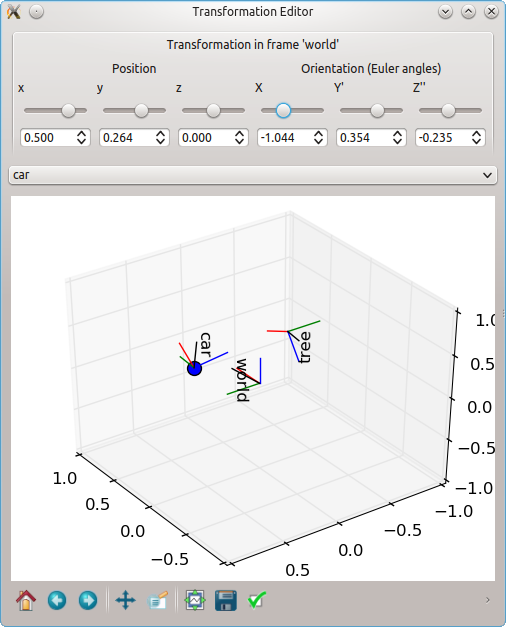
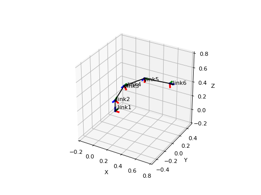

# Summary

pytransform3d is a Python library for transformations in three dimensions.
Heterogenous software systems that consist of proprietary and open source
software are often combined when we work with transformations.
For example, suppose you want to transfer a trajectory demonstrated by a human
to a robot. The human trajectory could be measured from an RGB-D camera, fused
with inertial measurement units that are attached to the human, and then
translated to joint angles by inverse kinematics. That involves at least
three different software systems that might all use different conventions for
transformations. Sometimes even one software uses more than one convention.
The following aspects are of crucial importance to glue and debug
transformations in systems with heterogenous and often incompatible software:

* Compatibility: Compatibility between heterogenous softwares is a difficult
  topic. It might involve, for example, communicating between proprietary and
  open source software or different languages.
* Conventions: Lots of different conventions are used for transformations
  in three dimensions. These have to be determined or specified.
* Conversions: We need conversions between these conventions to
  communicate transformations between different systems.
* Visualization: Finally, transformations should be visually verified
  and that should be as easy as possible.

pytransform3d assists in solving these issues. Its documentation clearly
states all of the used conventions, it makes conversions between rotation
and transformation conventions as easy as possible, it is tightly coupled
with Matplotlib to quickly visualize (or animate) transformations and it
is written in Python with few dependencies. Python is a widely adopted
language. It is used in many domains and supports a wide spectrum of
communication to other software.

The library focuses on readability and debugging, not on computational
efficiency.
If you want to have an efficient implementation of some function from the
library you can easily extract the relevant code and implement it more
efficiently in a language of your choice.

The library integrates well with the scientific Python ecosystem
[@SciPyLectureNotes] with its core libraries Numpy, Scipy and Matplotlib.
We rely on Numpy [@Walt2011] for linear algebra and on Matplotlib
[@Hunter2007] to offer plotting functionalities.
Scipy [@Jones2001] is used if you want to automatically
compute new transformations from a graph of existing transformations.

More advanced features of the library are the TransformManager which manages
complex chains of transformations, the TransformEditor which allows to modify
transformations graphically (additionally requires PyQt4), and the
UrdfTransformManager which is able to load transformations from
the Unified Robot Description Format (URDF) (additionally requires
beautifulsoup4).

One of the strengths of pytransform3d in comparison to most other libraries
is its rigorous approach to testing. Unit tests have 100% branch coverage
for code that is not related to visualization, there is more test code than
library code, there are additional examples, and continuous integration
runs with Python 2.7, 3.4, 3.5, and 3.6. The maintainer ensures that this
level of quality will not be sacrificed for new features.

There are several similar software packages. ROS tf2 [@Foote2009] is probably
the most widely used of them. It offers functionality that is similar to
the TransformManager of pytransform3d, but also considers temporal aspects
of transformations. It also provides conversions between various conventions
and visualization can be done with ROS' rviz package.
EnviRe [@HidalgoCarrio2016] provides similar functionality.
However, both libraries come with a number of dependencies and require
complex build tools. Hence, it is not easy to set them up quickly in
a new environment with minimum impact to the system, while pytransform3d
is a lightweight library that only requires the basic scientific Python
software stack that runs on any machine that supports CPython.
There are other lightweight Python libraries that offer transformations
and conversions between conventions, for example, transforms3d [@Brett2009]
and rowan [@Ramasubramani2018], but these do not directly support
visualization.

## Research

pytransform3d is used in various domains, for example,
specifying motions of a robot, learning robot movements from human
demonstration, and sensor fusion for human pose estimation.
pytransform3d has been used by @Gutzeit2018 in the context of
learning robot behaviors from demonstration.

# Acknowledgements

We would like to thank Manuel Meder and Hendrik Wiese who have given
valuable feedback as users to improve pytransform3d.
This work was supported through two grants of the German Federal
Ministry of Economics and Technology (BMWi, FKZ 50 RA 1216 and FKZ 50 RA 1217)
and two grants from the European Union's Horizon 2020 research and innovation
program (723853 and 730014).

# References